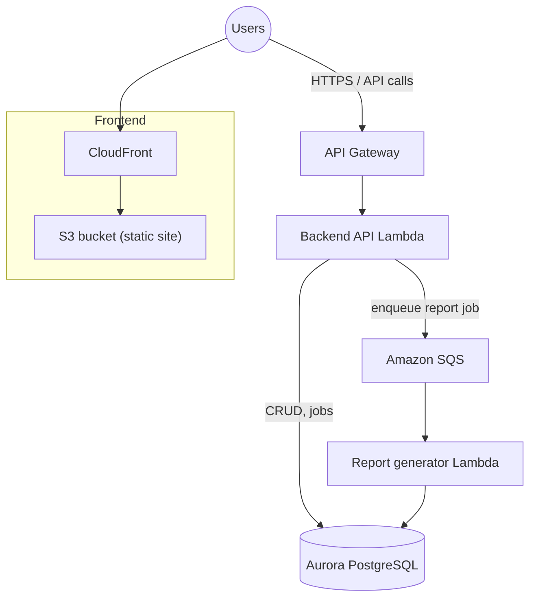

# Muninn

**Muninn** is a camp program manager: administrators manage **programs**, **courses**, **parents**, **students**, and **enrollments**, and can trigger **AI-generated end-of-camp reports** for parents. The system uses a static **Next.js** frontend, a **FastAPI** backend on **AWS Lambda** behind **API Gateway**, **Amazon Aurora** (PostgreSQL) via the **RDS Data API**, and a **reporter** Lambda driven by **SQS** for asynchronous report jobs.

---

## Platform architecture (AWS)

End-to-end, the **camp manager** stack looks like this: a static **frontend** in **S3** behind **CloudFront**; an **API Gateway** in front of the **backend API** (AWS Lambda + FastAPI) that uses **Aurora PostgreSQL** for CRUD; and **asynchronous report generation** via **SQS** and a **report generator (reporter) Lambda** that writes results (for example `report_payload` on `jobs`) back to the same **Aurora** database.

- **Synchronous path:** Browser → CloudFront (cached assets) for the UI; application calls go to API Gateway → API Lambda, which uses the **RDS Data API** to reach Aurora.
- **Asynchronous path:** When a report is requested, the API creates a job and sends a **message to SQS**; the **reporter Lambda** consumes the queue, runs the agent pipeline, and **persists** the report to Aurora.

The diagram below is the **original handwritten reference**; the Mermaid figure above is the same flow in a renderable form.

Handwritten camp manager infrastructure sketch

---

## Repository layout

| Path                                       | What it is                                                                                            |
| ------------------------------------------ | ----------------------------------------------------------------------------------------------------- |
| `[frontend/](frontend/)`                   | Next.js app (Clerk, static export). See `[frontend/README.md](frontend/README.md)`.                   |
| `[backend/api/](backend/api/)`             | FastAPI application for Lambda.                                                                       |
| `[backend/database/](backend/database/)`   | Aurora / RDS Data API client and models — `[backend/database/README.md](backend/database/README.md)`. |
| `[backend/reporter/](backend/reporter/)`   | Report generator Lambda and packaging — `[backend/reporter/README.md](backend/reporter/README.md)`.   |
| `[terraform/](terraform/)`                 | Infrastructure (database, agents, frontend).                                                          |
| `[.github/workflows/](.github/workflows/)` | Deploy and destroy pipelines.                                                                         |
| `[scripts/](scripts/)`                     | Shell helpers for deploy/destroy.                                                                     |

---

## Quick start (local development)

- **Frontend:** `cd frontend && npm install && npm run dev` — needs `NEXT_PUBLIC_API_URL` pointing at the API.
- **API:** run from `backend/api` as documented there (commonly Uvicorn against the same venv that has `muninn-database`).

CI deploys the full stack; see `scripts/deploy_*.sh` and `.github/workflows/deploy.yml` for **dev** / **test** / **prod** flows.